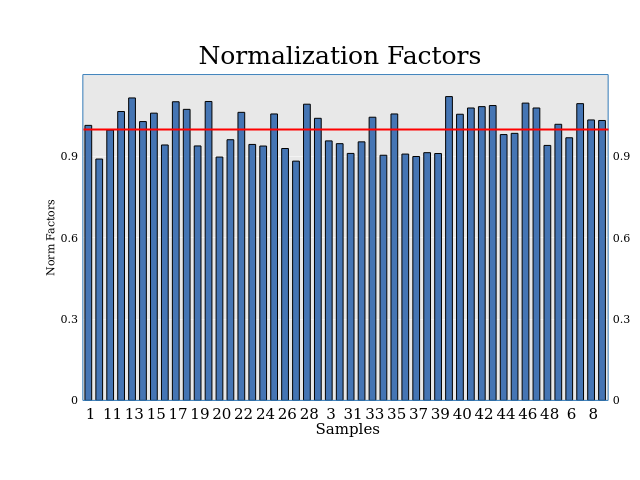
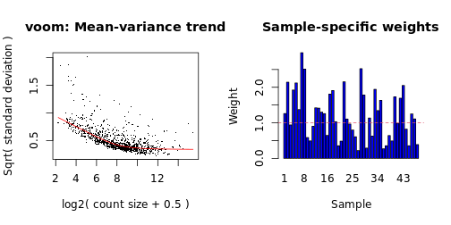

# Introduction and Setup

## Demonstration Dataset: Rat Liver Slice Compound Treatments

The following dataset was selected to demonstrate building and working with the DGEobj data structure and associated utilities

>  Huang X, Cai H, Ammar R, Zhang Y et al. Molecular characterization of a
>  precision-cut rat liver slice model for the evaluation of antifibrotic
>  compounds. Am J Physiol Gastrointest Liver Physiol 2019 Jan 1;316(1):G15-G24. PMID: 30406699

Briefly, livers were removed from rats 4 weeks after bile duct ligation or sham operation. Rat liver slices were incubated in vitro with potential anti-fibrotic compounds. At the end of the incubation whole transcriptome RNA-Seq analysis was performed.

Files containing counts, sample annotations, and QC data associated with this project can be downloaded from the [NCBI GEO resource](https://www.ncbi.nlm.nih.gov/geo/query/acc.cgi?acc=GSE120804).

The GEO data includes Ensembl gene IDs. Additional gene information such as chromosome positions, type of transcript, etc., are downloaded from Ensembl using the biomaRt package.

## Starting DGEobj creation

The starting point for the discussions in this vignette is a DGEobj that is ready for analysis.  The demonstration dataset detailed above is used to create the DGEobj R object step-by-step in sections 1-4 of the DGEobj package vignette:  [DGEobj_Overview](https://CRAN.R-project.org/package=DGEobj/vignettes/DGEobj_Overview.html).  This vignette can be accessed from inside an R session using `vignette("DGEobj_Overview", package = "DGEobj")`.  The detailed instructions are not be repeated in this vignette, but the starting R object named "dgeObj" is created with the same steps/data as detailed in sections 1-4.


Columns available in this object for building contrasts:


```r
designCol <- "ReplicateGroup"

str_c(designCol, (unique(dgeObj$design[[designCol]])))
```

```
## [1] "ReplicateGroupBDL_Sora"     "ReplicateGroupBDL"          "ReplicateGroupBDL_Nint"     "ReplicateGroupBDL_EXT-1024" "ReplicateGroupSham"
```

If using formulas there may be a few additional steps that may be necessary depending on the data:


```r
## This step is only necessary IF there is a numeric column that you want
## to treat as a factor in formulas
dgeObj$design$ReplicateGroup <- as.factor(dgeObj$design$ReplicateGroup)

## This step is only necessary if you want to use a ~ 1 formula.
## The desired baseline must be made the first factor and thus the default baseline
dgeObj$design$ReplicateGroup <- relevel(dgeObj$design$ReplicateGroup, "Sham")

kable(inventory(dgeObj))
```


|ItemName      |ItemType      |BaseType |Parent        |Class      |Row  |Col |DateCreated         |
|:-------------|:-------------|:--------|:-------------|:----------|:----|:---|:-------------------|
|counts_orig   |counts_orig   |meta     |              |matrix     |1000 |48  |2021-04-08 11:04:01 |
|counts        |counts        |assay    |counts_orig   |matrix     |1000 |48  |2021-04-08 11:04:01 |
|design_orig   |design_orig   |meta     |              |data.frame |48   |10  |2021-04-08 11:04:01 |
|design        |design        |col      |design_orig   |data.frame |48   |10  |2021-04-08 11:04:01 |
|geneData_orig |geneData_orig |meta     |              |data.frame |1000 |8   |2021-04-08 11:04:01 |
|geneData      |geneData      |row      |geneData_orig |data.frame |1000 |8   |2021-04-08 11:04:01 |
|granges_orig  |granges_orig  |meta     |geneData_orig |GRanges    |1000 |NA  |2021-04-08 11:04:01 |
|granges       |granges       |row      |geneData      |GRanges    |1000 |NA  |2021-04-08 11:04:01 |

## Limma/Voom Workflow Reference

At this point our starting object is fully setup for the analysis.  The next step is to run the Limma/Voom Differential Gene Expression analysis as described in:

> Law CW, Alhamdoosh M, Su S et al. RNA-seq analysis is easy as 1-2-3 with
> limma, Glimma and edgeR.  F1000Research 2018, 5:1408. [DOI: 10.12688/f1000research.9005.3](https://doi.org/10.12688/f1000research.9005.3)


<br/><br/>

# Pre-processing

## Low Intensity Filtering

Typically, genes with near zero counts are removed before further analysis. They contain no useful information, increase the multiple test burden, and could (under some conditions) compromise the normalization and violate assumptions implicit in linear modeling.

Two methods for low intensity filtering are supplied; min counts, and FPK.  The lowIntFilter function will use any combination of these methods.  The sampleFraction argument defines the proportion of samples that must meet all specified criteria to keep a gene.

It is typically recommended to use counts >= 10 and FPK >=5.  But the filter should be set as close as possible to criteria the original analyst used.  A custom filter can also be substituted.

Minimum counts >= 10 is commonly used to filter out low intensity genes.  But mincount is biased against short genes.  In contrast, FPK (fragments per kilobase), described below, provides an intensity measure that is not length biased.

Fragments per kilobase (FPK) is another filtering criterion.  For an average size ~2kb mRNA FPK = 5 is equivalent to counts = 10, however, FPK is not length biased.   Another useful property of FPK is that FPK can be calculated for intergenic DNA and thus provides an empirical background level of stochastic or spurious transcription.  This estimate is surely conservative in that there is very likely some real transcription going on in intergenic regions.  Typically, the intergenic FPK level is below 5 so FPK >= 5 is an appropriate threshold.

The FPK + mincount filters can both be applied together to select detected genes. The one must decide how to integrate this information across multiple samples and experiment groups. You can get more sophisticated and do this on a group-wise basis so you can include genes that were expressed in at least one of your treatment groups. That is left as an exercise for the reader -- note that groupwise filtering introduces a bias that affects your pvalue calibration.  To avoid such bias, simply require 50% of samples to pass the intensity threshold and then modify the percentage to adjust the stringency.

If using FPK, a length adjusted measure, you must also supply the geneLength argument. A Gene length value for each gene is thus required in the gene annotation if FPK is to be used.  The RSEM algorithm for generating gene counts also provide an effective length calculation for each gene that may be  conveniently used for the FPK calculations.

In this example, only the counts were provided in the GEO source and thus the gene length information required to use FPK is not available.  Therefore, a simple count threshold will be used and 50% of samples are required to meet these criteria for the gene to be included.

**Dimensions before filtering: 1000, 48 **


```r
# Gene filter criteria
countThreshold <- 10   # Must meet or exceed this value
sampleFraction <- 0.5  # Fraction of samples that must meet the criteria

dgeObj <- lowIntFilter(dgeObj,
                       countThreshold = countThreshold,
                       sampleFraction = sampleFraction)
```

**Dimensions after filtering: 1000, 48 **


## Filter for Protein Coding Genes

Often an analysis is focused on protein-coding genes.  Here the Ensembl gene_biotype column is used in the gene annotation to keep only protein-coding genes.


```r
idx    <- dgeObj$geneData$gene_biotype == "protein_coding"
dgeObj <- dgeObj[idx,]
```

**Dimensions after filtering for protein_coding: 951, 48 **


<br/><br/>

# DGE Analysis

## edgeR Normalization

This step simply applies edgeR::calcNormFactors to effect TMM normalization. This results in a DGEList object being added to the DGEobj.  Note that the counts matrix within the DGEList object is NOT normalized counts.  Rather a separate item in the DGEList contains the norm factors and you should use the edgeR cpm function to extract normalized counts from the DGEList.


```r
data   <- runEdgeRNorm(dgeObj, includePlot = TRUE)
dgeObj <- data[[1]]

data[[2]]
```



## Define the Model Formula

Provide a formula and construct the design matrix:


```r
# Formula must be composed of column names from the design table
formula <- '~ 0 + ReplicateGroup'

# User-defined name for the designMatrix
designMatrixName <- "ReplicateGroupDesign"

# Build the designMatrix
design <- getItem(dgeObj, "design")
designMatrix <- model.matrix(as.formula(formula), design)

# Make sure the column names in the design matrix are legal
colnames(designMatrix) <- make.names(colnames(designMatrix))

# Capture the formula as an attribute of the design matrix
attr(designMatrix, "formula") <- formula

# Add the designMatrix to the DGEobj
dgeObj <- addItem(dgeObj,
                  item      = designMatrix,
                  itemName  = designMatrixName,
                  itemType  = "designMatrix",
                  parent    = "design",
                  overwrite = TRUE)
```

## Check for Surrogate Variables (unaccounted-for variation)

SVA looks for hidden structure in the data using PCA-like methods.  It  defines surrogate variables that can be added to your model to account  for systematic trends that do not map to known experiment factors.  This can improve power to detect changes due to factors of interest.

The ReplicateGroup design column captures both disease status and drug treatment groups.  With this design, no SVs are detected.


```r
log2cpm      <- convertCounts(dgeObj$counts,
                              unit      = "cpm",
                              log       = TRUE,
                              normalize = "tmm")

designMatrix <- DGEobj::getItem(dgeObj, designMatrixName)

sva::num.sv(log2cpm, designMatrix, method = "leek")
```

```
## [1] 0
```

To illustrate SVA use, a model is constructed using only disease status and ignoring compound treatment.  The compound treatment effects should be discoverable as a surrogate variable.

Note that here the SVA output is captured in a fork of the main DGEobj.


```r
# Formula must be composed of column names from the design table.
formula <- '~ 0 + DiseaseStatus'

# User-defined name for the designMatrix
designMatrixName <- "DiseaseStatusDesign"

# Build the designMatrix
design <- getItem(dgeObj, "design")
designMatrix <- model.matrix(as.formula(formula), design)

# Make sure the column names in the design matrix are legal
colnames(designMatrix) <- make.names(colnames(designMatrix))

# Capture the formula as an attribute of the design matrix
attr(designMatrix, "formula") <- formula

# Add the designMatrix to the DGEobj
dgeObj_SVA <- addItem(dgeObj,
                      item      = designMatrix,
                      itemName  = designMatrixName,
                      itemType  = "designMatrix",
                      parent    = "design",
                      overwrite = TRUE)

dgeObj_SVA <- runSVA(dgeObj_SVA, designMatrixName = designMatrixName)
```

```
## Number of significant surrogate variables is:  1 
## Iteration (out of 5 ):1  2  3  4  5
```

Indeed SVA now identifies one surrogate variable.

If n.sv is >0, the runSVA function adds the following changes to the DGEobj:

1. Adds a column for each SV to the design table
2. Stores the svobj from the SVA analysis
3. Creates and stores a new design matrix with the SV columns and adds a "_sva" suffix to the designMatrix name

The user can then use the new design matrix to incorporate the SVs into the analysis.


|ItemName                  |ItemType      |BaseType |Parent              |Class      |Row  |Col |DateCreated         |
|:-------------------------|:-------------|:--------|:-------------------|:----------|:----|:---|:-------------------|
|counts_orig               |counts_orig   |meta     |                    |matrix     |1000 |48  |2021-04-08 11:04:01 |
|counts                    |counts        |assay    |counts_orig         |matrix     |951  |48  |2021-04-08 11:04:01 |
|design_orig               |design_orig   |meta     |                    |data.frame |48   |10  |2021-04-08 11:04:01 |
|design                    |design        |col      |design_orig         |data.frame |48   |11  |2021-04-08 11:04:01 |
|geneData_orig             |geneData_orig |meta     |                    |data.frame |1000 |8   |2021-04-08 11:04:01 |
|geneData                  |geneData      |row      |geneData_orig       |data.frame |951  |8   |2021-04-08 11:04:01 |
|granges_orig              |granges_orig  |meta     |geneData_orig       |GRanges    |1000 |NA  |2021-04-08 11:04:01 |
|granges                   |granges       |row      |geneData            |GRanges    |951  |NA  |2021-04-08 11:04:01 |
|DGEList                   |DGEList       |assay    |counts              |DGEList    |951  |48  |2022-05-19 14:23:33 |
|ReplicateGroupDesign      |designMatrix  |col      |design              |matrix     |48   |5   |2022-05-19 14:23:33 |
|DiseaseStatusDesign       |designMatrix  |col      |design              |matrix     |48   |2   |2022-05-19 14:23:34 |
|DiseaseStatusDesign_svobj |svobj         |meta     |DiseaseStatusDesign |list       |4    |NA  |2022-05-19 14:23:34 |
|DiseaseStatusDesign_sva   |designMatrix  |col      |DiseaseStatusDesign |matrix     |48   |3   |2022-05-19 14:23:34 |


## Run Voom and fit the model (lmFit)

The duplicateCorrelation method in Voom optionally allows the user to account for a random effect, such as repeated measurements on the same animal in this case.

To invoke duplicateCorrelation in the runVoom function, assign a blocking variable to the dupCorBlock argument.


```r
## Use duplicateCorrelation when subjects have been sampled more than once even
## if under different conditions (e.g. treated, untreated)
dupCorBlock <- dgeObj$design$AnimalNum
designMatrixName <- "ReplicateGroupDesign"

# Defaults are: qualityWeights = TRUE, runEBayes = TRUE, robust = TRUE
if (is.null(dupCorBlock)) {
  dgeObj <- runVoom(dgeObj, designMatrixName)
} else {
  dgeObj <- runVoom(dgeObj, designMatrixName, dupCorBlock = dupCorBlock)
}
```



```
## Duplicate Correlation = 0.0232
```

The Mean-variance trend nicely shows the heteroscedasticity typical of RNA-Seq data (variance dependent on intensity).

If a downward hook on the left end of this distribution is observed, it means a more stringent low intensity filter should be used.


## Run Contrasts

Function runContrasts takes a named list of contrasts (see config chunk).


```r
# Name the design matrix to be used
designMatrixName <- "ReplicateGroupDesign"

# Print the available column names for constructing contrasts:
print(colnames(dgeObj$ReplicateGroupDesign))
```

```
## [1] "ReplicateGroupSham"         "ReplicateGroupBDL"          "ReplicateGroupBDL_EXT.1024" "ReplicateGroupBDL_Nint"     "ReplicateGroupBDL_Sora"
```

```r
# Define the named contrasts from design matrix column names
contrastList  <- list(BDL_vs_Sham    = "ReplicateGroupBDL - ReplicateGroupSham",
                      EXT1024_vs_BDL = "ReplicateGroupBDL_EXT.1024  - ReplicateGroupBDL",
                      Nint_vs_BDL    = "ReplicateGroupBDL_Nint - ReplicateGroupBDL",
                      Sora_vs_BDL    = "ReplicateGroupBDL_Sora - ReplicateGroupBDL"
)

dgeObj <- runContrasts(dgeObj,
                       designMatrixName = designMatrixName,
                       contrastList     = contrastList,
                       qValue           = TRUE,
                       IHW              = TRUE)

kable(inventory(dgeObj))
```


|ItemName                    |ItemType       |BaseType |Parent                                           |Class      |Row  |Col |DateCreated         |
|:---------------------------|:--------------|:--------|:------------------------------------------------|:----------|:----|:---|:-------------------|
|counts_orig                 |counts_orig    |meta     |                                                 |matrix     |1000 |48  |2021-04-08 11:04:01 |
|counts                      |counts         |assay    |counts_orig                                      |matrix     |951  |48  |2021-04-08 11:04:01 |
|design_orig                 |design_orig    |meta     |                                                 |data.frame |48   |10  |2021-04-08 11:04:01 |
|design                      |design         |col      |design_orig                                      |data.frame |48   |10  |2021-04-08 11:04:01 |
|geneData_orig               |geneData_orig  |meta     |                                                 |data.frame |1000 |8   |2021-04-08 11:04:01 |
|geneData                    |geneData       |row      |geneData_orig                                    |data.frame |951  |8   |2021-04-08 11:04:01 |
|granges_orig                |granges_orig   |meta     |geneData_orig                                    |GRanges    |1000 |NA  |2021-04-08 11:04:01 |
|granges                     |granges        |row      |geneData                                         |GRanges    |951  |NA  |2021-04-08 11:04:01 |
|DGEList                     |DGEList        |assay    |counts                                           |DGEList    |951  |48  |2022-05-19 14:23:33 |
|ReplicateGroupDesign        |designMatrix   |col      |design                                           |matrix     |48   |5   |2022-05-19 14:23:33 |
|ReplicateGroupDesign_Elist  |Elist          |assay    |DGEList             , ReplicateGroupDesign       |EList      |951  |48  |2022-05-19 14:23:38 |
|ReplicateGroupDesign_corFit |corFit         |meta     |ReplicateGroupDesign_Elist                       |list       |3    |NA  |2022-05-19 14:23:38 |
|ReplicateGroupDesign_fit    |fit            |row      |ReplicateGroupDesign_Elist, ReplicateGroupDesign |MArrayLM   |951  |5   |2022-05-19 14:23:38 |
|ReplicateGroupDesign_fit_cm |contrastMatrix |meta     |ReplicateGroupDesign_fit                         |matrix     |5    |4   |2022-05-19 14:23:39 |
|ReplicateGroupDesign_fit_cf |contrast_fit   |row      |ReplicateGroupDesign_fit                         |MArrayLM   |951  |4   |2022-05-19 14:23:39 |
|BDL_vs_Sham                 |topTable       |row      |ReplicateGroupDesign_fit_cf                      |data.frame |951  |13  |2022-05-19 14:23:39 |
|EXT1024_vs_BDL              |topTable       |row      |ReplicateGroupDesign_fit_cf                      |data.frame |951  |13  |2022-05-19 14:23:39 |
|Nint_vs_BDL                 |topTable       |row      |ReplicateGroupDesign_fit_cf                      |data.frame |951  |13  |2022-05-19 14:23:39 |
|Sora_vs_BDL                 |topTable       |row      |ReplicateGroupDesign_fit_cf                      |data.frame |951  |13  |2022-05-19 14:23:39 |

After executing runContrasts, the topTable dataframes are present in the DGEobj and the DGE analysis is complete.


## Alternative FDR scores

topTable provides a BH FDR value (adj.P.Val).  Two optional FDR measures are supported that add additional columns to the topTable results. Use the Qvalue and IHW arguments to invoke these additional FDR measures.

* `Qvalue = TRUE` adds "qvalue" and "qvalue.lfdr" columns to the topTable output.
* `IHW = TRUE` adds columns "ihw.adj_pvalue" and "ihw.weight".

See the vignettes for the qvalue and IHW packages for more details on these alternative FDR measures.
